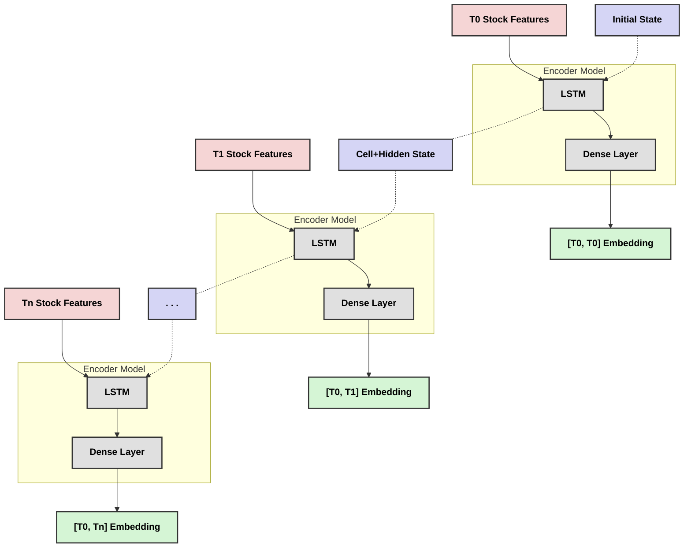
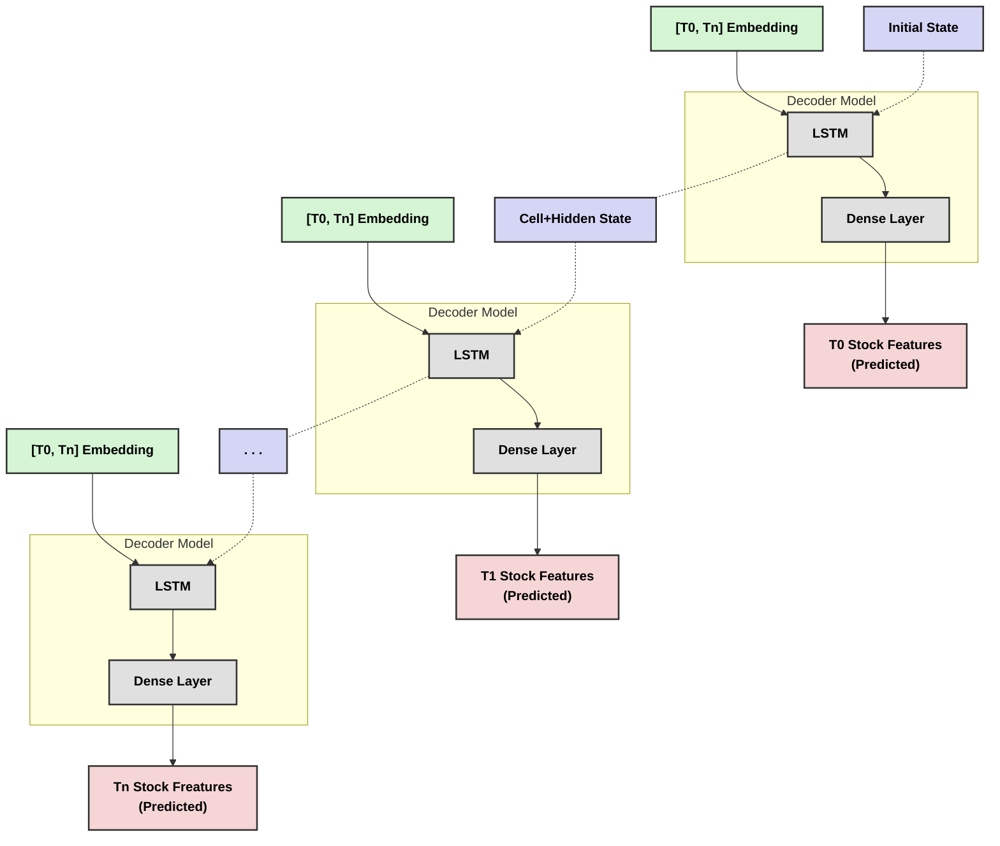

# Research Notes (Stock Prediction)

## Table of Contents

## Rough Project Ideas:

1. Create encoder-decoder model. In the latent space, fix some dimensions to represent transformation parameters: scale, rotation, shift. Force the other dimensions to be invariant to transformations (by taking the difference of these features between transformations of the same image and performing gradient desent)

> I don't think this is very different from what we saw in class.

2. Take the utop transformation of some data and use it as the target for a repression model. This should create a smooth representation of the utop transformation. The key assumption here is examples whose raw feature values are similar (have a close distance) will also be close in the embedding space. We hope that an embedding space that preserves these properties will encode useful information about the examples.

3. Applying hidden markov model to stock data:

   - represent the market visible state as an array of
     stock market sectors _ top n companies _ (open, close, high, low)
   - The goal is to learn how to distribute investments over the market
     - therefore, we can normalize prices based on their sum at a given time
   - Parts of the model
     1. Latent/recurrent state-to-state module
     2. Latent state to normalized prices (i.e. price distribution)
   - The idea is not to predict the price of individual stocks, but predict how changes in certain sectors of the market propagate across the market (low frequency)

4. Applying adversarial noise to model training on financial data.

## Stock Prediction Project

### Data

#### Data Features

"Stock Features" refers to any of the following:

- Ticker Values

  - High
  - Low
  - Volume
  - Open
  - Close (Adjusted)

- Other KPIs

  - P/E ratio
  - P/B ratio
  - P/S ratio
  - Earnings Per Share (EPS)
  - Revenue

- Temporal Features

  - Interval size over which ticker info was taken (Haven't seen this commonly available? We calculate ourselves?)
  - Timestamp itself (just a counter?)
  - Position in year (cyclically encoded)
  - Position in a quarter (cyclically encoded)
  - Position in a month (cyclically encoded)
  - Position in a week (cyclically encoded)
  - Position in a day (cyclically encoded)

- Identity Features

  - Stock Symbol (one-hot encoded + optional embedding) (Would model overfit on this? Do we want to include? Do we want our model to generalize to any stock regardless of symbol?)
  - Sector (one-hot encoded + optional embedding) (This seems most useful out of ID features!)
  - Source Exchange (one-hot encoded + optional embedding) (would this really matter?)

- "meta" features
  - Headlines at the time the stock data was sampled
  - Weather data at the time the stock data was sampled
  - Twitter data at the time the stock data was sampled
  - Satelite imagery at the time the stock data was sampled

"Market Features" refers to stock features when we are considering a collection of several stocks together.

#### Data Formats

**General Note:** I define many of the tasks below as prediction/supervision tasks.
Since our task should be self-supervised, the actual task should be finding embeddings where fine-tuning with a linear probe performs well on these embeddings.

**General Note** I am somewhat worried about the effects of inflation/market-wide price shifts.
I think we should look for ways to normalize against inflation.
It might benefit us in several ways:

1. Prevents our model from overfitting to the magnitude of the inputs.
2. Reduces modal shift over time.
3. Modules don't have an inherent scaling property:
   They perform matrix multiplication between features and weights, but there isn't a way to scale feautures by other features besides locally-linear approximation (I think).
4. Captures the idea that we don't care about about the absolute price.
   For example, if I am all-in on stock A, and it goes up by 50%, but so do all other stocks in the market, then I don't really gain an advantage by maintaining my position, even though I gained value in an absolute sense.

##### (1) Individual Stocks (Time Independent)

- **Format:** One datum consists of a vector of stock features for a single stock at a single moment in time.

- **Task:** We would seek to predict some stock features at any moment in time given other stock features at that time.
  We would NOT be predicting across time, just over the same stock at a moment in time.

- **Note:** The order of vectors through time does not matter.
  We consider the examples individually in any order.

##### (2) Market Slices (Time Independent)

- **Format:** One datum consists of a concatenated set of stock feature vectors at a single moment in time.

- **Task:** We would seek to predict stock features of the market at a moment in time given some other market features at the same moment. We would NOT be predicting across time, just over the market at a moment in time.

- **Note:** If formulated this way, we would not need to encode the stock symbols and instead have a column for each stock-feature pair.
  The number of columns would be ((n features) x (n stocks)).

- **Note:** The order of vectors through time does not matter.
  We consider the examples individually in any order.

##### (3) Individual Stocks (Time Series)

- **Format:** One datum consists of a vector of stock features for a single stock at a single moment in time.

- **Task:** We would seek to predict the features of the stock at time (t+1) after observing the features for time 0-t (or some shorter interval, not necessarily starting at the beginning of sequence history).

- **Note:** Each stock has its own sequence.

- **Note:** We now consider all the stock feature vectors as a sequence through time.

##### (4) Market Slices (Time Series)

- **Format:** One datum consists of a concatenated set of stock feature vectors at a single moment in time.

- **Task:** We would seek to predict the features of the stock at time (t+1) after observing the features for time 0-t (or some shorter interval, not necessarily starting at the beginning of sequence history).

- **Note:** We now consider all the market feature vectors as a sequence through time.

- **Note** There is only a single "mega-sequence"

### Pipelines/Tasks

#### Single Stock Prediction

Data is a sequence of Stock Features over time.
In other words, a single sequence looks like table whose columns are stock features and whose rows are the times at which those features were sampled.

#### Time-Series Embedding Options

##### Simple LSTM Encoder:

**Note:** It might make sense to pass the stock features through a dense layer before passing them to the LSTM layer.

**Note** T0 does not have to be the beginning of the entire time series, just the beginning of some segment of size $n$.

**Note:** To perform decoding, essentially just flip the model around.
The decoder should take in the final encoding of the sequence and reproduce.

**Note** In the simplest form of decoding, we repeatedly provide the same final encoding as the input for the decoder.
The changes in the output will solely be due to the changes in the hidden and cell states shared implicitly between LSTM modules.
The idea is that they will learn what information to focus on in the embedding at different points through the sequnce.

##### Simple LSTM Decoder:

**Note:** This seems like it would be unreliable for long sequences.
We don't have any way of "guiding" the decoder if it starts going off-track during its prediction.

**Question:** What if we let the decoder continue past the Tn?
Would it learn to predict future states?

**Question:** What if we start off the decoder where the encoder leaves off, so that the decoder is _ONLY_ predicting future states?
What would happen?

##### LSTM Autoregressive Decoder:

**Note:** In the autoregressive approach, the decoder model consumes AND PRODUCES latent space representations.
i.e. given a sequence of latent space representations, it predicts the next latent space representation.
We will need a seperated final layer to translate these prodicted latent-space vectors back to stock features.

**Note:** With the autoregressive approach, we can use teacher-forcing to train the model.

**Note:** I think that the major different between the autoregressive approach and the simle encoder-decoder is that the autoencoder will learn a good representation of the current stock/market state.
However, the autoregressor will prioritize encoding information that helps predict future market states.

- ^ Is this not the same information?
- What if we let the simple decoder continue past the end of its encoded sequence and the calculate the loss against the future states?

```mermaid
graph LR
    %% Input node for the initial latent embedding from the encoder
    E0["<b style='color:black'>[T0, Tn] Embedding</b>"] --> L0

    %% Model processing nodes inside subgraphs
    subgraph subgraph0["Autoregressive Decoder"]
        L0["<b style='color:black'>LSTM</b>"] --> D0["<b style='color:black'>Dense Layer</b>"]
    end
    subgraph subgraph1["Autoregressive Decoder"]
        L1["<b style='color:black'>LSTM</b>"] --> D1["<b style='color:black'>Dense Layer</b>"]
    end
    subgraph subgraph2["Autoregressive Decoder"]
        L2["<b style='color:black'>LSTM</b>"] --> D2["<b style='color:black'>Dense Layer</b>"]
    end

    %% Output nodes for predicted time step
    D0 --> E1["<b style='color:black'>[T0, T(n+1)] Embedding\n(Predicted)</b>"]
    E1 --> L1

    D1 --> E2["<b style='color:black'>T1 Stock Features\n(Predicted)</b>"]
    E2 --> L2

    D2 --> E3["<b style='color:black'>T1 Stock Features\n(Predicted)</b>"]

    %% Arrows indicating transfer of cell state between LSTM layers
    C0["<b style='color:black'>Initial State</b>"] -.-> L0
    L0 -.- C1["<b style='color:black'>Cell+Hidden State</b>"] -.-> L1
    L1 -.- C2["<b style='color:black'>. . .</b>"] -.-> L2

    %% Styling the nodes for better text visibility
    style E0 fill:#d5f5d5,stroke:#333,stroke-width:2px;
    style L0 fill:#e0e0e0,stroke:#333,stroke-width:2px;
    style D0 fill:#e0e0e0,stroke:#333,stroke-width:2px;
    style E1 fill:#d5f5d5,stroke:#333,stroke-width:2px;

    style L1 fill:#e0e0e0,stroke:#333,stroke-width:2px;
    style D1 fill:#e0e0e0,stroke:#333,stroke-width:2px;
    style E2 fill:#d5f5d5,stroke:#333,stroke-width:2px;

    style L2 fill:#e0e0e0,stroke:#333,stroke-width:2px;
    style D2 fill:#e0e0e0,stroke:#333,stroke-width:2px;
    style E3 fill:#d5f5d5,stroke:#333,stroke-width:2px;

    style C0 fill:#d5d5f5,stroke:#333,stroke-width:2px;
    style C1 fill:#d5d5f5,stroke:#333,stroke-width:2px;
    style C2 fill:#d5d5f5,stroke:#333,stroke-width:2px;

    %% Subgraph styling
    classDef modelGraph fill:#e0e0e0,stroke:#333,stroke-width:2px;
    class L0,L1,L2,D0,D1,D2 modelGraph;

    %% Subgraphs for the final layers
    E0 --> D3["<b style='color:black'>Final Layer(s)</b>"] --> F0["<b style='color:black'>Tn Stock Features\n(Predicted)</b>"]
    E1 --> D4["<b style='color:black'>Final Layer(s)</b>"] --> F1["<b style='color:black'>T(n+1) Stock Features\n(Predicted)</b>"]
    E2 --> D5["<b style='color:black'>Final Layer(s)</b>"] --> F2["<b style='color:black'>T(n+2) Stock Features\n(Predicted)</b>"]
    E3 --> D6["<b style='color:black'>Final Layer(s)</b>"] --> F3["<b style='color:black'>T(n+3) Stock Features\n(Predicted)</b>"]

    style D3 fill:#e0e0e0,stroke:#333,stroke-width:2px;
    style D4 fill:#e0e0e0,stroke:#333,stroke-width:2px;
    style D5 fill:#e0e0e0,stroke:#333,stroke-width:2px;
    style D6 fill:#e0e0e0,stroke:#333,stroke-width:2px;
    style F0 fill:#f5d5d5,stroke:#333,stroke-width:2px;
    style F1 fill:#f5d5d5,stroke:#333,stroke-width:2px;
    style F2 fill:#f5d5d5,stroke:#333,stroke-width:2px;
    style F3 fill:#f5d5d5,stroke:#333,stroke-width:2px;
```

## Data Sourcing:

Tips from Ivan Kwon (Econ Prof):

- Center for Research in Security Prices (CRSP)
- We may have access to Wharton Research Data (WRDS) via the Brown Library which should include (CRSP)
- Just use Yahoo finance historical data

Cass Wilkinson Saldaña (Social Science Data Librarian)

We have a few options for historical stock data, which vary based on historical coverage, interval, etc. What is the extent of stock data you need? Based on your answer, a few options:

1. WRDS@Brown - Database: WRDS (Wharton Research Data Services) - Library Guides at Brown University : WRDS is actually a platform that hosts several datasets. We have some CRSP stock that may be of interest (only updated annually, but should include end-of-day pricing): Center for Research in Security Prices, LLC (CRSP) (upenn.edu). You can create a WRDS account and explore the data directly.

2. We have a limited number of seats for Tick History, which is an LSEG product via their DataScope select service. We could work together to extract data, whether via a library-held account or granting you a direct account. (There is an API we can use for this, too). If this is of interest, please let us know and we can reach out to our account managers. Tick History Data | LSEG

Let me know what you think of these two options! Happy to meet with you directly and explore options together if you want to find time during my office hours: https://calendar.app.google/mmx1s34m2YdxnA236

## Papers

### Kaan's Final Report

#### Abstract:

- Data: S&P 500 Index
- Compared 3 regression models
  1. Feed Forward
  2. CNN
  3. CNN + LSTM combo

QUESTION: How does the CNN work on the data? 1D over time? 1D over stocks?

#### Data:

https://www.kaggle.com/datasets/andrewmvd/sp-500-stocks

Columns:

- Date
- Symbol
- Adjusted Close (adjusted for splits)
- Close
- High
- Low
- Open
- Volume

They encoded the dataset as it is in Kaggle: 1 datapoint per symbol each day i.e. 500 datapoints per day.

They initially tried one-hot encoding the categorical categories.
This resulted in a very sparse matrix, so they ditched the idea.
The sample complexity was already high --- with this approach the loss essentially did not decrease over 50 epochs.

QUESTION: Since stocks are ranked, consider thermometer encoding?

QUESTION: Could they perform some dimensionality reduction before training (PCA? ICA? Short FF Encder/Decoder Network? Kernel PCA?

QUESTION: It seems like the way that the data is formatted in is not super conducive to ML.
Rather than the a data point being the stats for 1 stock on a given day, what about making a datapoint the snapshot of all stocks on a given day --- with dimensionality `(n_stocks) x  (n_KPIs)`.

They ended up with:

- Exchange: binary one-hot encoded
- Sector: integer encoded
- Industry: integer encoded
- Symbol: integer encoded

#### Prediction:

Embedding:

- All three models embed before prediction
- Preprocess:
  - Close column is made into labels
  - Date column is split into 3 integer columns (Year/month/day)
  - Numerical features are normalized

QUESTION: Numerical features are normalized relative to what?

QUESTION: Seems like year/month/day should be cyclically encoded. Then the day/timestamp of the column should have its own column.

QUESTION: Why is the first layer of the NLP so big? The prediction pipeline is "features of one stock on one day" to "closing price of that one stock". If we are only starting with ~60 features, an initial layer of several thousand seems large.

Rules of thumb I found for MLP:

> 1. Hidden layers:
>
>    - Number of hidden layers: Start with 1-2 hidden layers. Only use more if the problem is complex and you have a large amount of training data.
>    - A common rule is to use 2-3 hidden layers for most problems. Very complex problems might require more.
>
> 2. Neurons in hidden layers:
>
>    - The "rule of thumb" is often to use a number of neurons between the size of the input and output layers.
>    - Another common approach is to start with a number of neurons in the hidden layer that's 2/3 the size of the input layer, plus the size of the output layer.
>    - Some suggest using a pyramid structure, where each subsequent layer has fewer neurons than the previous one.
>
> 3. General sizing rules:
>
>    - The number of neurons in each hidden layer should be between the size of the input layer and the size of the output layer.
>    - The number of hidden neurons should be 2/3 the size of the input layer, plus the size of the output layer.
>    - The number of hidden neurons should be less than twice the size of the input layer.
>
> 4. Specific formulas some practitioners use:
>    - $N_h = N_s / (\alpha * (N_i + N_o))$
>      Where $N_h$ is the number of hidden neurons, $N_s$ is the number of samples in the training dataset, $N_i$ is the number of input neurons, $N_o$ is the number of output neurons, and $\alpha$ is an arbitrary scaling factor usually 2-10.

QUESTION: Not clear how testing was performed --- was it just a randomm split? There might be data leakage between training and testing.

### iBot: Image BERT Pre-Training with Online Tokenizer
